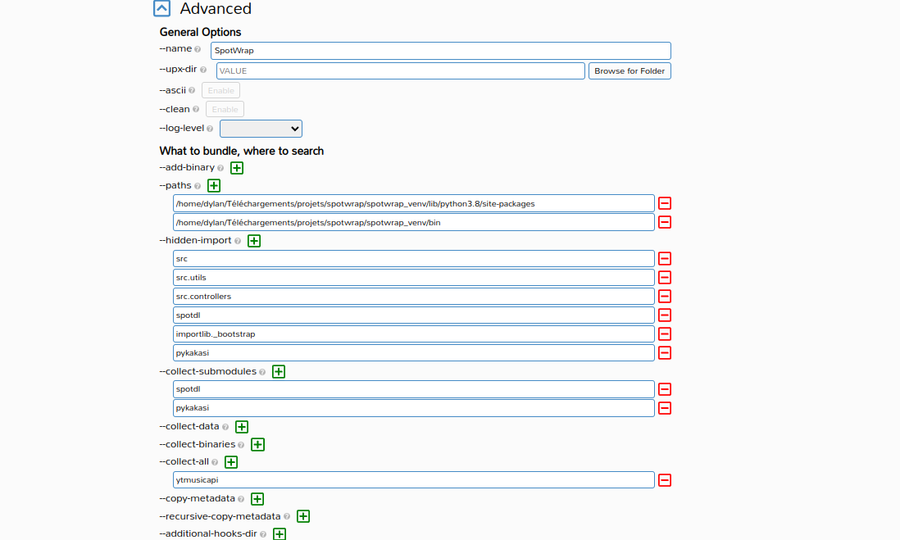

# SpotWrap
### A graphical wrapper for Spotdl and Savify
### Gallery
### How to use
Paste your spotify song/album/playlist link to the search bar, hit enter,
then you can select the output type and the quality you want. Then simply click on Download.
### How to compile using pyinstaller and auto-py-to-exe
First you have to install the dependencies using pip, I recommend using a virtual environment
```bash
python -m venv venv
```
Then you have to activate the virtual environment:
- on windows : 
```bash
venv\Scripts\activate
```
- on linux:
```bash
source venv/bin/activate
```

Some dependencies are not available on pypi, so you have to install them manually before installing the other:
```bash
pip install --use-pep517 git+https://github.com/stschake/savify@feature/use-yt-dlp
```
Then you have to install the dependencies using pip
```bash 
pip install -r requirements.txt
```


Then you have to compile the python file using pyinstaller:
- For linux :
Screenshot of all the options to use (use your own paths). The add-binary section is only for windows: 
- For Windows: you also have to bundle ffmpeg for the application to work (it's the add-binary section). 
Download ffmpeg binaries for your os from [Here](https://www.gyan.dev/ffmpeg/builds/ffmpeg-release-full.7z). 
Create a new directory named 'ffmpeg_win' in repository root directory. Copy three files 'ffmpeg.exe', 'ffprobe.exe', 'ffplay.exe' from downloaded archive to just created 'ffmpeg_win' directory.
here is the pyinstaller command (also use your own paths):
  ```pyinstaller --noconfirm --onedir --windowed --icon "C:/Users/HP/Downloads/spotwrap/assets/images/download_icon.png" --name "SpotWrap" --add-binary "C:/Users/HP/Downloads/spotwrap/ffmpeg_win/ffmpeg.exe;." --add-binary "C:/Users/HP/Downloads/spotwrap/ffmpeg_win/ffplay.exe;." --add-binary "C:/Users/HP/Downloads/spotwrap/ffmpeg_win/ffprobe.exe;." --paths "C:/Users/HP/Downloads/spotwrap/spotwrap_venv/Lib/site-packages" --paths "C:/Users/HP/Downloads/spotwrap/spotwrap_venv/Scripts" --hidden-import "src" --hidden-import "src.utils" --hidden-import "src.controllers" --hidden-import "spotdl" --hidden-import "importlib._bootstrap" --hidden-import "pykakasi" --collect-submodules "spotdl" --collect-submodules "pykakasi" --collect-all "ytmusicapi" --collect-data "" --collect-all "pykakasi"  "C:/Users/HP/Downloads/spotwrap/main.py"```
